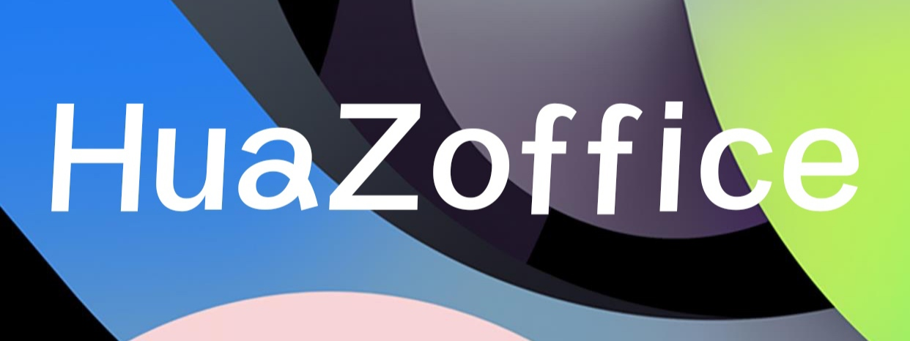

# Magisk_phh_treble_patch

## introduction
▪If you are using treble from PHH, please swipe in this patch and then Magisk_phh.
▪Brush from recovery mode！
（The translation is from Youdao Dictionary）
## 介绍
▪我们都知道phh的gsi不能直接刷入面具。
▪如果你正在使用phh制作的treble，那么请先刷入这个补丁，然后再刷入面具phh版。
一定要在recovery种刷入！

## 城通网盘
[-blue)](https://url27.ctfile.com/f/31252227-515788418-7b9189)
## 捐赠
如果你喜欢这个项目，请给我捐赠，谢谢
